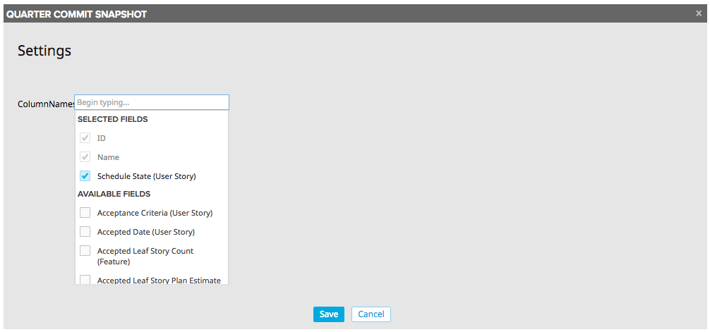

#Quarter Commit Snapshot

This application lets the user query a list of User Stories or Features committed to a release based on two different dates. Following are the list of functions.
- Lets the user select a Release and Type (User Story or Feature).
- Lists the planned estimate for both the dates given.
- Shows if the User Story was part of the User Story or Feature (In Date1? / In Date2?).
- Show changed option lets the user view the artifacts that has changed (that is was committed on one date but not the other). 
- Download the grid to CSV.
- Lists higher level PIs as a column.
- Add/remove columns as needed.

You will be able to add /remove grid columns on App Settings.

####Steps to install the Application
 1. On your dashboard, click on the gear to add an app.
 2. Choose "Custom HTML" from the App Catalog. Add the app.
 3. Paste the code to HTML text area from the link - https://raw.githubusercontent.com/RallyTechServices/quarter-commit-snapshot/master/deploy/App.txt
 4. Click Save.

####Steps to get started:
 1. Once the application is installed, Click on the gear on top right corner of the app to open App Settings and choose the columns for the grid. 
 2. Save app settings.
 3. Select a release.
 4. Select User Story or Feature
 5. Select Date 1 (default value would be 3 weeks from Release Start Date).
 6. Select Date 2 (default value is current date).
 7. Click on Show changed if needed. 
 8. Click on "GO!"" to display the grid. 
 9. Click on "Download CSV" button to download the grid to a csv file

## Development Notes

### First Load

If you've just downloaded this from github and you want to do development, 
you're going to need to have these installed:

 * node.js
 * grunt-cli
 * grunt-init
 
Since you're getting this from github, we assume you have the command line
version of git also installed.  If not, go get git.

If you have those three installed, just type this in the root directory here
to get set up to develop:

  npm install

### Structure

  * src/javascript:  All the JS files saved here will be compiled into the 
  target html file
  * src/style: All of the stylesheets saved here will be compiled into the 
  target html file
  * test/fast: Fast jasmine tests go here.  There should also be a helper 
  file that is loaded first for creating mocks and doing other shortcuts
  (fastHelper.js) **Tests should be in a file named <something>-spec.js**
  * test/slow: Slow jasmine tests go here.  There should also be a helper
  file that is loaded first for creating mocks and doing other shortcuts 
  (slowHelper.js) **Tests should be in a file named <something>-spec.js**
  * templates: This is where templates that are used to create the production
  and debug html files live.  The advantage of using these templates is that
  you can configure the behavior of the html around the JS.
  * config.json: This file contains the configuration settings necessary to
  create the debug and production html files.  
  * package.json: This file lists the dependencies for grunt
  * auth.json: This file should NOT be checked in.  Create this to create a
  debug version of the app, to run the slow test specs and/or to use grunt to
  install the app in your test environment.  It should look like:
    {
        "username":"you@company.com",
        "password":"secret",
        "server": "https://rally1.rallydev.com"
    }
  
### Usage of the grunt file
####Tasks
    
##### grunt debug

Use grunt debug to create the debug html file.  You only need to run this when you have added new files to
the src directories.

##### grunt build

Use grunt build to create the production html file.  We still have to copy the html file to a panel to test.

##### grunt test-fast

Use grunt test-fast to run the Jasmine tests in the fast directory.  Typically, the tests in the fast 
directory are more pure unit tests and do not need to connect to Rally.

##### grunt test-slow

Use grunt test-slow to run the Jasmine tests in the slow directory.  Typically, the tests in the slow
directory are more like integration tests in that they require connecting to Rally and interacting with
data.

##### grunt install

Use grunt install to build the deploy file and then install it into a new page/app in Rally.  It will create the page on the Home tab and then add a custom html app to the page.  The page will be named using the "name" key in the config.json file (with an asterisk prepended).

To use this task, you must create an auth.json file that contains the following keys:
{
    "username": "fred@fred.com",
    "password": "fredfredfred",
    "server": "https://us1.rallydev.com"
}

(Use your username and password, of course.)  NOTE: not sure why yet, but this task does not work against the demo environments.  Also, .gitignore is configured so that this file does not get committed.  Do not commit this file with a password in it!

When the first install is complete, the script will add the ObjectIDs of the page and panel to the auth.json file, so that it looks like this:

{
    "username": "fred@fred.com",
    "password": "fredfredfred",
    "server": "https://us1.rallydev.com",
    "pageOid": "52339218186",
    "panelOid": 52339218188
}

On subsequent installs, the script will write to this same page/app. Remove the
pageOid and panelOid lines to install in a new place.  CAUTION:  Currently, error checking is not enabled, so it will fail silently.
